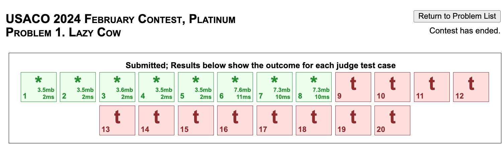

Ok, so I just finished writing the sophomore reflection post, and my mom wants me to be more productive this summer by writing daily reflections as well. It is a lot of reflecting I am doing right now, but it is probably good. I'll make this more detailed in the future (tomorrow, surely).

I don't want this to clutter my blog too much, so I'll probably post this biweekly or something. Not too interesting, but just a way to be accountable and stuff.

#### Monday, June 10, 2024

- Started off the day with solving a DS1 problem which I had left behind, [Groceries in Meteor Town](https://codeforces.com/problemset/problem/1628/E). Pretty interesting problem, uses DS and graph nicely. 
- Also messed around with some webdev stuff on WebPlotDigitizer, to try to familiarize myself with it, but I didn't do anything significant - mainly just understand some of the underlying structure of `index.html` and `wpd.min.js`. Main takeaway is that I'm pretty shit at understanding HTML, JS, CSS, so I'm going to take a course.
- Made some blog posts which is cool
- Did not shower before 11:27 PM which is not optimal

I would rate this day like 3/10. I had already made some progress on the problem some time before, so a lot of time was killed debugging. Not very locked in.

Plan for tomorrow: 
- Solve >= 1 problem on DS1, or plat, or something similar
- Finish [relevant unit of measure, haven't looked too much into it] for coursera on webdev of HTML JS CSS
- Hold office hours for CPI
- Grind more coursera (I've realized that doing webdev shit is pretty inefficient/impractical before I finish the course)

#### Tuesday, June 11, 2024
- Started off the day with solving a DS1 problem, [Souvenirs](https://codeforces.com/gym/450135/problem/V). Rated 3100, but I've seen the sweep with segtree approach before. I think it was pretty interesting in that it considered two cases of $a_i < a_j$ and $a_i \geq a_j$ separately, and then combined the answers. Implementation was pretty smooth - I wrote a sparse segtree, and other stuff worked out fine.

- Grinded quite a bit of the [webdev course](https://www.coursera.org/learn/html-css-javascript-for-web-developers/home/welcome). I put most of the lectures on 2x speed, and finished ~50% of it today. However, there are assignments and stuff that are coming up, so I'll probably slow down a bit. To be honest, HTML is pretty straightforward, but CSS is a nightmare. Hopefully as I gain more experience, it will become less complicated?

I would rate this day a 7/10. The only thing that could really be improved would be being more efficient on the DS1 problem. I think I implemented like 90% of it really fast, but then I made some typoes, TLE, etc, which cost a lot of time. Coursera I powered through pretty quickly, although for some reason I got pretty mentally tired and had to stare into space for a while before starting again. Still, I got through around 10 hours of video, so that is not bad.

I think I checked discord and stuff less today, so that is progress.

Tomorrow will probably be similarly straightforward.

Plan for tomorrow:
- Solve 1 DS1 problem
- If time permits (finish decently quickly) solve another DS1 problem (unlikely?)
- Grind more coursera, hopefully finish week 4 (I'm currently halfway through week 3, but it'll get more difficult to remember everything as time goes on)

#### Wednesday, June 12, 2024
It is late, so I'll keep it short
- solved ds1 problem (nice virtual tree application, i'll link tmrw)
    - upd: [treeland and viruses](https://codeforces.com/gym/450135/problem/X)
- tried to solve previous ds1 problem, failed, don't understand edi well enough (it's chinese), asked jb, no response yet \:///
- tried to fullsolve jan plat p3, got sol with right time complexity, but my segtree is slow so i'm optimizing it tmrw to hopefully be my first full plat ac

rating: 4/10, felt like i could've debugged a lot less if i were less stupid

tmrw:
- finish plat problem
- do another ds1 problem
- look at another plat problem
- do fullstack course

#### Thursday, June 13, 2024
- solved plat jan p3! no edi. My solution was pretty close to edi, but I did some range multiply stuff and imho it was cleaner. To go from TLE --> AC, I had to implement a more efficient segtree based on KACTL, which I'm surprised runs that fast. i guess in the future i'll implement segtrees in that style
- solved ds1 problem. It was like ~3300, and it turns out the solution is just to sort and do some iterating. I think it's an interesting problem, and feels like silver but also has some nuance to it. Interesting problem, but idk how to motivate a solution
- did fullstack course. Ok NGL CSS/Bootstrap stuff is pretty difficult, idk. I think I am getting more of a feel for stuff. Like given a webpage i can probably implement it, but it will be in a very hack way. hopefully this goes away

rating: 5/10. Idk, I was pretty productive, but it just felt average in general

tmrw: 
- do a plat problem (hopefully no edi)
- do another ds1 problem
- fullstack course grind

#### Friday, June 14, 2024
- solved this russian ds1 problem, the editorial was pretty convoluted but i got a merging vectors solution in O(N^2 * Q) or something. I think the problem difficulty was slightly overrated. Pretty standard iirc, although edge cases were annoying
- ok, then i started doing plat feb24p1. I got a solution, where it is like optimal to keep stuff monotonically decreasing, and you do segtree to keep it that way. i think the idea is not that hard, but i did some sloppy binary search stuff instead of walk on segtree, which adds an extra log factor. turns out, that is the difference between TLE and AC on the later testcases (pretty much rn my $n\log^2 n$ solution is behaving slow enough to not be distinguished from $n^2$, which is pretty shit). 

Funny coincedence - this trick to cut the $\log^2$ to a $\log$ was literally the first thing we learned in XCamp 602P, so I guess that comes in handy sometimes. I'm tired, I'll implement it tomorrow. Hopefully AC?

Goodnight I guess. 

tmrw:
- attend tennis lesson?
- finish this problem
- do GLIFY debate logistics for next week
- do 603p hw (ngl combinatorics this week is pretty nontrivial, especially p3: [luogu4708](https://www.luogu.com.cn/problem/P4708)) - it looks like i'll finally have to make a luogu account

#### Saturday, June 15, 2024
Ok, it is technically Sunday at the time I am writing this (12:38). Trivialities asside, here is what I did:
- failed to implement taht plat problem, I'm messing around with some DS, it is very hard to think through, hopefully more luck later
- did tennis lesson
- did GLIFY Debate Logistics
- taught CPI class
- did 2/3 603p hw, burnside is becoming more intuitive now. I just finished [SHOI2006: Graph Coloring](https://www.luogu.com.cn/problem/P4128), it was pretty neat counting once I figured it out. 

tmrw:
- finish 603p hw
- finish preparing for GLIFY debate camp
- finish plat problem

#### Sunday, June 16, 2024

It's 12:00 (tmrw) again, so I'll keep it short
today:
- finished 603p hw
- cleaned up some debate camp stuff
- finished webdev week 4/5
- tried joi (joi p1)

tmrw:
- finish debugging/joi p1
- final prep for debate camp p1
- finish that one plat problem ._.
- grind out webdev course

### Monday, June 17, 2024

today:
- finish plat problem, joi problem
- hosted first day of debate camp
- finished webdev content, still need to do final assignment
- got email from internship interview

tmrw:
- upsolve joi p3
- do debate camp day 2
- finish webdev course
- prepare for interview

### Tuesday June 18, 2024

today:
- finished joi library3, intersting problem
- host second day of debate camp
- finished webdev final assignment
- interview prep

tmrw:
- fail interview
- try to finish 60pt subtask of joi heat
- more usaco?
- debate camp

### Wednesday June 19, 2024

today:
- finished joi heat subtask 2
- host third day of debate camp
- did interview
- failed usaco, ds1 problem

tmrw:
- finish ds1 problem
- finish other ds1 problem
- find a plat problem to do
- debate camp