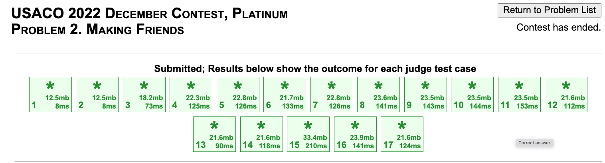

Ok, so I just finished writing the sophomore reflection post, and my mom wants me to be more productive this summer by writing daily reflections as well. It is a lot of reflecting I am doing right now, but it is probably good. I'll make this more detailed in the future (tomorrow, surely).

I don't want this to clutter my blog too much, so I'll probably post this biweekly or something. Not too interesting, but just a way to be accountable and stuff.

#### Monday, June 10, 2024

- Started off the day with solving a DS1 problem which I had left behind, [Groceries in Meteor Town](https://codeforces.com/problemset/problem/1628/E). Pretty interesting problem, uses DS and graph nicely. 
- Also messed around with some webdev stuff on WebPlotDigitizer, to try to familiarize myself with it, but I didn't do anything significant - mainly just understand some of the underlying structure of `index.html` and `wpd.min.js`. Main takeaway is that I'm pretty shit at understanding HTML, JS, CSS, so I'm going to take a course.
- Made some blog posts which is cool
- Did not shower before 11:27 PM which is not optimal

I would rate this day like 3/10. I had already made some progress on the problem some time before, so a lot of time was killed debugging. Not very locked in.

Plan for tomorrow: 
- Solve >= 1 problem on DS1, or plat, or something similar
- Finish [relevant unit of measure, haven't looked too much into it] for coursera on webdev of HTML JS CSS
- Hold office hours for CPI
- Grind more coursera (I've realized that doing webdev shit is pretty inefficient/impractical before I finish the course)

#### Tuesday, June 11, 2024
- Started off the day with solving a DS1 problem, [Souvenirs](https://codeforces.com/gym/450135/problem/V). Rated 3100, but I've seen the sweep with segtree approach before. I think it was pretty interesting in that it considered two cases of $a_i < a_j$ and $a_i \geq a_j$ separately, and then combined the answers. Implementation was pretty smooth - I wrote a sparse segtree, and other stuff worked out fine.

- Grinded quite a bit of the [webdev course](https://www.coursera.org/learn/html-css-javascript-for-web-developers/home/welcome). I put most of the lectures on 2x speed, and finished ~50% of it today. However, there are assignments and stuff that are coming up, so I'll probably slow down a bit. To be honest, HTML is pretty straightforward, but CSS is a nightmare. Hopefully as I gain more experience, it will become less complicated?

I would rate this day a 7/10. The only thing that could really be improved would be being more efficient on the DS1 problem. I think I implemented like 90% of it really fast, but then I made some typoes, TLE, etc, which cost a lot of time. Coursera I powered through pretty quickly, although for some reason I got pretty mentally tired and had to stare into space for a while before starting again. Still, I got through around 10 hours of video, so that is not bad.

I think I checked discord and stuff less today, so that is progress.

Tomorrow will probably be similarly straightforward.

Plan for tomorrow:
- Solve 1 DS1 problem
- If time permits (finish decently quickly) solve another DS1 problem (unlikely?)
- Grind more coursera, hopefully finish week 4 (I'm currently halfway through week 3, but it'll get more difficult to remember everything as time goes on)

#### Wednesday, June 12, 2024
It is late, so I'll keep it short
- solved ds1 problem (nice virtual tree application, i'll link tmrw)
    - upd: [treeland and viruses](https://codeforces.com/gym/450135/problem/X)
- tried to solve previous ds1 problem, failed, don't understand edi well enough (it's chinese), asked jb, no response yet \:///
- tried to fullsolve jan plat p3, got sol with right time complexity, but my segtree is slow so i'm optimizing it tmrw to hopefully be my first full plat ac

rating: 4/10, felt like i could've debugged a lot less if i were less stupid

tmrw:
- finish plat problem
- do another ds1 problem
- look at another plat problem
- do fullstack course

#### Thursday, June 13, 2024
- solved plat jan p3! no edi. My solution was pretty close to edi, but I did some range multiply stuff and imho it was cleaner. To go from TLE --> AC, I had to implement a more efficient segtree based on KACTL, which I'm surprised runs that fast. i guess in the future i'll implement segtrees in that style
- solved ds1 problem. It was like ~3300, and it turns out the solution is just to sort and do some iterating. I think it's an interesting problem, and feels like silver but also has some nuance to it. Interesting problem, but idk how to motivate a solution
- did fullstack course. Ok NGL CSS/Bootstrap stuff is pretty difficult, idk. I think I am getting more of a feel for stuff. Like given a webpage i can probably implement it, but it will be in a very hack way. hopefully this goes away

rating: 5/10. Idk, I was pretty productive, but it just felt average in general

tmrw: 
- do a plat problem (hopefully no edi)
- do another ds1 problem
- fullstack course grind

#### Friday, June 14, 2024
- solved this russian ds1 problem, the editorial was pretty convoluted but i got a merging vectors solution in O(N^2 * Q) or something. I think the problem difficulty was slightly overrated. Pretty standard iirc, although edge cases were annoying
- ok, then i started doing plat feb24p1. I got a solution, where it is like optimal to keep stuff monotonically decreasing, and you do segtree to keep it that way. i think the idea is not that hard, but i did some sloppy binary search stuff instead of walk on segtree, which adds an extra log factor. turns out, that is the difference between TLE and AC on the later testcases (pretty much rn my $n\log^2 n$ solution is behaving slow enough to not be distinguished from $n^2$, which is pretty shit). 

Funny coincedence - this trick to cut the $\log^2$ to a $\log$ was literally the first thing we learned in XCamp 602P, so I guess that comes in handy sometimes. I'm tired, I'll implement it tomorrow. Hopefully AC?

Goodnight I guess. 

tmrw:
- attend tennis lesson?
- finish this problem
- do GLIFY debate logistics for next week
- do 603p hw (ngl combinatorics this week is pretty nontrivial, especially p3: [luogu4708](https://www.luogu.com.cn/problem/P4708)) - it looks like i'll finally have to make a luogu account

#### Saturday, June 15, 2024
Ok, it is technically Sunday at the time I am writing this (12:38). Trivialities asside, here is what I did:
- failed to implement taht plat problem, I'm messing around with some DS, it is very hard to think through, hopefully more luck later
- did tennis lesson
- did GLIFY Debate Logistics
- taught CPI class
- did 2/3 603p hw, burnside is becoming more intuitive now. I just finished [SHOI2006: Graph Coloring](https://www.luogu.com.cn/problem/P4128), it was pretty neat counting once I figured it out. 

tmrw:
- finish 603p hw
- finish preparing for GLIFY debate camp
- finish plat problem

#### Sunday, June 16, 2024

It's 12:00 (tmrw) again, so I'll keep it short
today:
- finished 603p hw
- cleaned up some debate camp stuff
- finished webdev week 4/5
- tried joi (joi p1)

tmrw:
- finish debugging/joi p1
- final prep for debate camp p1
- finish that one plat problem ._.
- grind out webdev course

### Monday, June 17, 2024

today:
- finish plat problem, joi problem
- hosted first day of debate camp
- finished webdev content, still need to do final assignment
- got email from internship interview

tmrw:
- upsolve joi p3
- do debate camp day 2
- finish webdev course
- prepare for interview

### Tuesday June 18, 2024

today:
- finished joi library3, intersting problem
- host second day of debate camp
- finished webdev final assignment
- interview prep

tmrw:
- fail interview
- try to finish 60pt subtask of joi heat
- more usaco?
- debate camp

### Wednesday June 19, 2024

today:
- finished joi heat subtask 2
- host third day of debate camp
- did interview
- failed usaco, ds1 problem

tmrw:
- finish ds1 problem
- finish other ds1 problem
- find a plat problem to do
- debate camp

### Thursday June 20, 2024

finished cloyster, plat cell merging, and ssr today. interesting problems, i guess dp is pretty hard, and i have to be more careful about edge cases?

fuck the debate camp students. they are all extremely retarded and education on them is a waste of time. they're all useless losers who have nothing to contribute to society. Although, I guess I am projecting a bit (a lot).

that was pretty much it today - just did some problems and then taught

tmrw:
- finish plat problem
- finish ds1 problem
- debate camp

### Sunday June 23, 2024

I have not posted in a while (busy, ig?). Today was decenlty productive. In the morning, i did some webdev project, similar to webplotdigitizer. I learned a bit about js and html in the process, so that was quite interesting. Then, i tried to do [cowntact tracing](https://usaco.org/index.php?page=viewproblem2&cpid=1356) with centroid decomposition (new thing i am learning, ig?) I got AC on most of it, but constant factored on the rest:

Tmrw:
- do another plat problem?
- work on webdev stuff
- do another problem

### Monday June 24, 2024

Finished plat problem (cowntact tracing). I asked around for centroid solutions that actually passed, and got some from omeganot and alternet. Unfortunately, I can't read/understand too well, but I did get a new idea of processing queries offline to cut a factor of 20, ending up AC. Before that however, this happend:

which was quite amusing to me. However, I ended up getting AC after a bit more optimization, so that was nice.

Other than that, I solved another 23-24 season plat problem (infinite adventure, scuffed binlift, not much to say), and then i'm moving on to the 22-23 season since the other problems are pretty impossible. I'm currently working on breakdown (dec22 p1), and i'm debugging, but it shouldn't be hard

tmrw
- finish breakdown
- finish webdev task
- find another plat problem

### Tuesday June 25, 2024

Finished breakdown (typos were the main issue, quite annoying). Ok, what was sad is that I thought "I'm so cool, this problem is simple, I shouldn't need to stress test", since the code was like ~100 lines, and I'm pretty used to debugging by 300 line ds bash. However, 40 minutes later, I wrote up `gen.cpp`, so... whatever.

I also did the other doable problem from that year - it was about graphs, surprisingly short solution, I had to read edi, pretty straightforward. Used small to large merging with sets, and I guess what I learned is that $O(n\log ^2 n)$ *can* indeed pass, but I guess this problem was relatively like simple and constant friendly, so not sure how much I should trust this in the future. For (my) future reference, this was the verdict and the times used:

So it passed in decent time, although I'm pretty sure my implementation was definitely faster than your typical log^2. Still pretty interesting tho.

Apart from that, I did some pdf cropping, but it's not finished yet, so I won't link it.

Tmrw:
- meet with fake nelson
- ask jb for problems/hints
- finish plat problem(s)?

### Wednesday June 26, 2024
It's 11:40, and I'm taking cf tmrw, so I'll keep it brief

today
- met with 7edu about scheduling (more on this tmrw, i guess)
- solved plat problem
- finished a section of pdf graph project

tmrw
- more 7edu bullshit
- take codeforces
- look at coci
- more pdf bullshit

### saturday june 29, 2024
I'm taking cf tmrw, yet again.
Finished 603p hw today. Mo's with rollback is not too difficult, once i implemented it once. Fractional programming (fancy binary search) also seemed pretty easy, until luogu was stupid and forced me to set precision exactly to 8. Random thought - in the future, I'll probably switch to using `printf` and `scanf` instead of `cout` and `cin`, because it is cooler. I also learned SPFA, which stands for shortest path faster algorithm (really, just optimized bellman). It is just Bellman with queue/stack, and it seems weird that you can optimize runtime by switching from queue or stack to vice versa and randomizing the order you put them in or something. I feel like (but haven't tested) the on average optimized case is faster than dijkstra since pq isn't needed, but I might be wrong since pq is *really* fast in cpp.

apart from that, i'm doing webdev. Firebase is weird, but manageable. Just that each project takes a long time to set up, and I need to understand a lot of different frameworks, which is quite overwhelming.

tmrw:
- win codeforces round
- take early ceoi if time
- upsolve ceoi obviousy
- try to get firebase login working

### sunday june 30, 2024
I took cf today. It was ok, I did A-E minus C, so that is decent. I'll upsolve C tmrw. Aside from that, I also took CEOI 2016 Day 1. P1 was interactive/communication, and I was able to get full points, using some DSU things. I had the general idea floating around as soon as I read it, but I first did some stuff on P2 before it solidifed into a solution. P2 was some interesting permutation stuff. I somehow passed a $O(n^4)$ ish solution for $n=200$, which was amusing. Thus, I managed to get 151 points, which is more than what Nelson Huang (orz) got! Still quite far behind Sicheng Zhou (200 pts) and Brian Xue (269 pts, iirc). The intended full solve to p2 was quite unmotivated and a messy DP, but you can do [connected component dp](https://codeforces.com/blog/entry/92602) to solve it in quite a concise and nice way - this is a solution approach to many permutation problems. P3 was a weird interaction which I'll do tmrw.

That was most of the day. I guess the only other notable thing was that I made a slideshow using beamer today for the CPI class, which was actually pretty satisfying. It is not hard, and results in pretty clean slides.

Tomorrow - upsolve, take another ceoi, set up some webdev. Pretty standard.

## thursday july 4, 2024
it has been a while since i posted. progress is ok, i guess? I'm roughly taking a mock every 2 days, currently CEOI, APIO. Also, keeping a spreadsheet, as jb told me to do. I want to be able to accelerate up to every day, but i'll need to upsolve faster.

Apart from that, did some webdev. Firebase is difficult, especially with next. It is difficult to get a big picture of it, so... Anyway, hopefully I can figure this all out in a decent fashion. PDF graphing heatmap project is going better, although I'm finding it difficult to organize all the files and functionality efficiently. I'll get more onto that when I can.

Tomorrow:
- upsolve APIO 2016 fireworks
- take APIO 2017
- take 603 class
- fail 603 hw

## saturday july 6, 2024
oops, should prolly post more often!! i was in a car for a lot of today since my family is coming back from tahoe. nevertheless, i managed to AC jump from noi2019 (k-d tree problem), as well as odd mineral resource from ds1/cf1479d. for the former, I had a MLE/TLE solution for a long time, just from a pq in dijkstra. What ended up fixing it is checkign whether you've already inserted a shorter time in the pq, but haven't processed it. It's a heuristic, sure, but it reduced runtime considerably. for the latter, it was a persistent segtree solution with random xor hashing. pretty interesting, but also decently standard persistent problem? at least, similar to destiny, the previous 603p hw problem, as you are searching the same segtree at multiple different "times". worried about ap scores, but whatever. I'm (probably) just scaring myself.

tmrw:
- teach cpi class
- upsolve whatever jb wants me to
- fuck aroudn with the zeitro db shit

## sunday july 7, 2024
tmrw ap tests come out. I feel like historicaly, since amador scores well, and I am definitely top 5 students in my ap bio class overall, surely i got a 5? I'm pretty worried. I guess it wasn't as locked down as the other ones, but whatever
Today, solved Oleg and Chess - interesting way to use segtrees and flows together. Not much else to say...

tmrw:
- understand internship stuff
- ask jb for questions to solve

## monday july 8 2024
ap tests came out. got some 5s, it is ok i guess. also solved 3 problems - rainbow something something i forgot name (apio 2017), traveling merchant (apio2017) and frequency problem (ds1). It is ok, I am enjoying persistent segtree and stuff. One fear i have is that i'm having trouble applying stuff i learn - traveling merchant was similar to a past 603 topic. i guess i just have to develop pattern recognition more...

tmrw:
- finish ds1 problem
- figure out zeitro api
- do more problem (ask jb, apio is getting difficult)